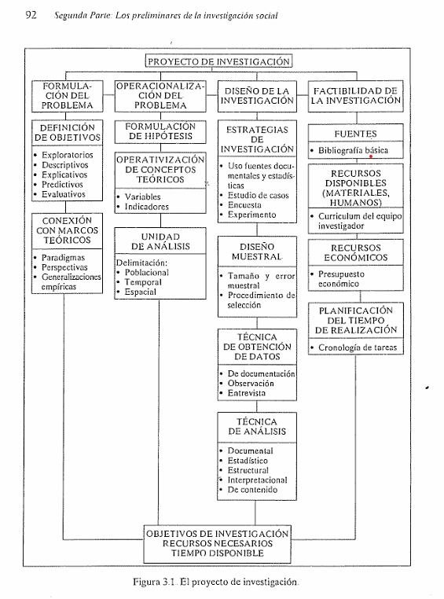
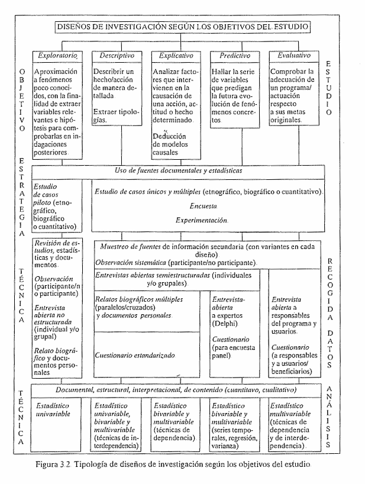
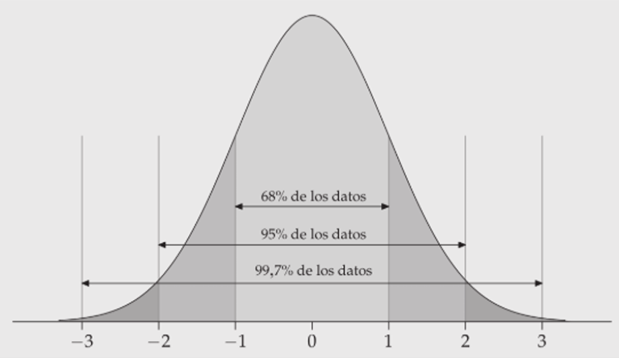
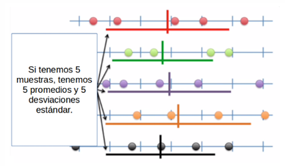
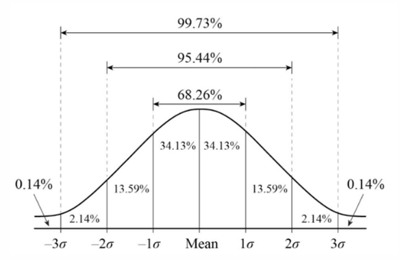
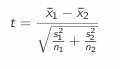
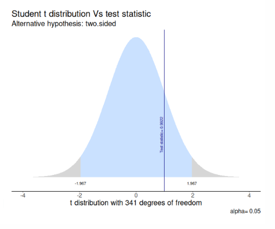

```{r setup, include=FALSE}
knitr::opts_chunk$set(
  echo    = TRUE,
  eval    = FALSE,
  comment = "#>",
  message = FALSE,
  warning = FALSE
)
```

background-color: #1a1a2e
class: middle

.badge[Ayudantía 05 · FAGOB 2026]

# Repaso prueba de cátedra 1

.divider[]

**Métodos Cuantitativos para la Administración Pública**

.muted[
Cristóbal Mejías &nbsp;·&nbsp; Facultad de Gobierno
Viernes 26 de abril, 2026
]

---

## índice


1. Repaso primeras unidades (30 minutos)
2. Repaso Inferencia (40 minutos)
3. Aplicación (20 minutos)


---

background-color: #e94560
class: center, middle, white

# Unidad 1

---

## ¿Qué sabemos sobre la Unidad 1?

- Sobre Investigación cuantitativa
- ¿Qué la diferencia?
- ¿Principales desafíos?

---
## Unidad 1: Principales lecturas

1. Raadschelders (2011)
2. Ramos (2016)

¿Qué podemos rescatar de estos textos?

---

background-color: #e94560
class: center, middle, white

# Unidad 2

---

## ¿Qué sabemos sobre la Unidad 2?


- ¿Cómo se formula un problema?
- ¿Cuáles son los tipos de diseño?
- ¿Cuáles son sus diferencias?

---

## Unidad 2: Principales lecturas

1. Cea (2001)
2. Hernández (2014)
3. Bellei (2013)

¿Qué podemos rescatar de estos textos?

---


<div style="text-align: center;">
  
</div>

---


<div style="text-align: center;">
  
</div>

--- 

background-color: #e94560
class: center, middle, white

# Unidad 3

---

## ¿Qué sabemos sobre la Unidad 3?


- ¿Cómo se miden los números?
- ¿Algunos ejemplos?
- ¿Cómo se construyen los indicadores?

---

background-color: #e94560
class: center, middle, white

# Unidad 4

---

## Principales términos 1:

- Población
- Muestra
- Inferencia
- Distribución...

---

## Curva normal:

Características

<div style="text-align: center;">
  
</div>

---

## Distribución normal del promedio

<div style="text-align: center;">
  
</div>

- SE = s / sqrt(N)
- Se calcula para el promedio, diferencia de promedios, correlación, etc.

---

##Intervalos de confianza

- Rango de valores dentro del cual se espera que se encuentr un parámetro poblacional con cierto nivél de confianza.

- Requiere determinar un nivel de confianza (en puntaje Z)
- Se debe sumar y restar SE

---

## Error y confianza

- 68% de confianza = 32% de error
- 95% de confianza = 5% de error

- Un IC mayor, mayor confianza, pero rango de valores muy amplio
- Un IC menor, menor confianza, pero rango de valores más estrecho

---

## 95% y 99% de confianza

- 95% en puntaje Z es 1.96 errores estándar
- 99% en puntaje Z es 2.58 errores estándar

<div style="text-align: center;">
  
</div>

---

## Práctico 1 (8 minutos):

En un Índice de Satisfacción Usuaria (0-100) en un servicio estatal, el promedio es de 55 puntos y con un error estándar de 8 puntos. Arme un IC con un nivel de confianza del 95% y otro para el 99%, y luego compare.

---

## Formulación de Hipótesis

*Pasos*

1. Formular Hipótesis
2. Obtener SE y estadístico de prueba
3. Establecer probabilidad de error
4. Cálculo de IC / contraste de valores empírico / crítico
5. Interpretación

---

## Sobre Hipótesis

| Tipo de Pregunta | Hipótesis Nula ($H_0$) | Hipótesis Alternativa ($H_1$) | Tipo de Prueba (Colas) | Direccionalidad |
| :--- | :--- | :--- | :--- | :--- |
| **¿Existe el promedio en la población?** | $H_0$: $\bar{x}$ = 0 | $H_1$: $\bar{x}$ $\neq$ 0 | Dos colas | No direccional |
| **¿Existe diferencias de promedios en la población?** | $H_0$: $\bar{x}$ 1  - $\bar{x}$ 2 = 0 | $H_1$: $\bar{x}$ 1  - $\bar{x}$ 2  $\neq$ 0| Dos colas | No direccional |

---

## Prueba T

T empírico/estadístico vs T crítico/teórico

T crítico dependerá de nuestro nivel de confianza:
- Si es 95% = 1.96
- Si es 99% = 2.58

Fórmula de T empírico (para diferencia de medias):

<div style="text-align: center;">
  
</div>

---

## Contraste de H

Si nuestro T empirico cae en la zona de rechazo (mayor a t crítico [1.96 o 2.58]) podemos rechazar nuestra H nula y generar evidencia a favor de nuestra H alternativa

<div style="text-align: center;">
  
</div>


---

background-color: #e94560
class: center, middle, white

# Aplicación

---

## Aplicación 2:

Con datos de una encuesta sobre satisfacción laboral se le pide comparar el tiempo promedio de satisfacción laboral entre trabajadores/as con jornada completa y trabajadores/as con jornada parcial.

Considerando la siguiente información:
- Tamaño muestral 500 
- Promedio satisfacción laboral jornada completa: 74 
- Promedio satisfacción laboral jornada parcial: 66 
- Error estándar (SE) de la diferencia de medias: 4
- Valor crítico t para alfa <0.05: 1.96
- Valor crítico t para alfa <0.01: 2.58
- t (empírico): 2


---


## Preguntas aplicación

1. Formule una hipótesis alternativa y una hipótesis nula para diferencia de promedios de horasde cuidado entre hombres y mujeres

2. Basándonos en el contraste entre valor crítico y empírico de t: ¿Es posible rechazar lahipótesis nula? Si es así, ¿Con qué nivel de confianza/probabilidad de error?

3. Construya un intervalo con un 95% de confianza para la diferencia de promedios e interpreteesta información

---

background-color: #e94560
class: center, middle, white

# Cierre

---


## Preparación para la prueba

- Repasar principales lecturas
- Estudiar ejemplos de AP

---

.badge[Ayudantía 05 · FAGOB 2026]

# ¡Nos vemos en la siguiente sesión!

.divider[]

**AY-6 · 8 de mayo**
Distribución muestral, pruebas de hipotesis, correlaciones - Práctico

.muted[
Cristóbal Mejías &nbsp;·&nbsp; Facultad de Gobierno
]
